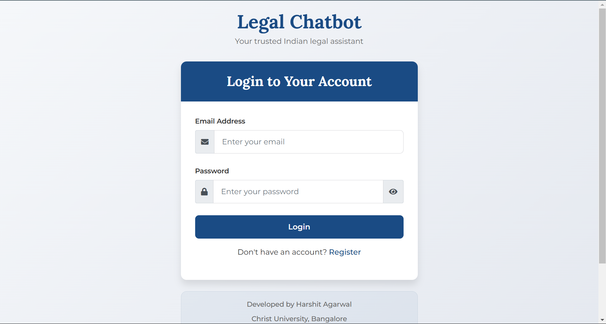
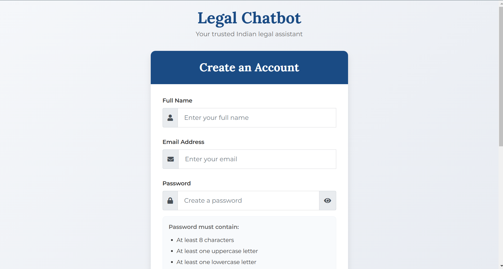
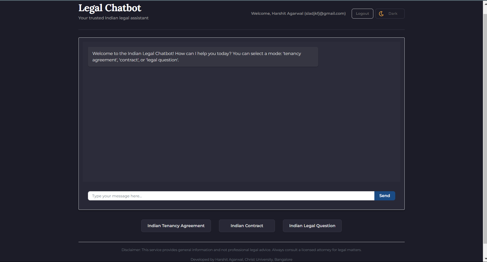

# Legal Chatbot - Indian Legal Assistant


A modern, intelligent chatbot designed to assist with Indian legal questions, contract creation, and tenancy agreements. Built with a user-friendly interface and powered by advanced natural language processing.

## Features

- 🤖 Interactive chat interface with real-time responses
- 📝 Generate customized legal documents:
  - Tenancy Agreements
  - Contracts
- ❓ Answer general legal questions based on Indian law
- 🌓 Dark/Light mode toggle for comfortable viewing
- 📱 Fully responsive design for all devices
- 🔒 Secure user authentication and session management

## Technology Stack

- **Frontend**: HTML5, CSS3, JavaScript
- **Styling**: Custom CSS with responsive design
- **Backend**: Flask (Python)
- **AI/ML**: Transformers for natural language processing
- **Document Generation**: Python-docx
- **Authentication**: JWT-based authentication

## Installation

### Prerequisites

- Python 3.8 or higher
- pip (Python package installer)
- Virtual environment (recommended)

### Setup Instructions

1. Clone the repository:
   ```bash
   git clone https://github.com/ItsHarshitAg/legal_chatbot.git
   cd legal_chatbot
   ```

2. Create and activate a virtual environment:
   ```bash
   python -m venv venv
   # On Windows
   venv\Scripts\activate
   # On macOS/Linux
   source venv/bin/activate
   ```

3. Install dependencies:
   ```bash
   pip install -r requirements.txt
   ```

4. Run the application:
   ```bash
   python src/app.py
   ```

6. Access the application at `http://localhost:5000`

## Usage

1. **Authentication**: Register/Login to access the chatbot
2. **Select a Mode**: Choose between "Tenancy Agreement", "Contract", or "Legal Question"
3. **Ask Questions**: Type your legal questions or provide details for document generation
4. **Download Documents**: Generated legal documents can be downloaded in Word format

### Sample Interactions

- **Legal Questions**: "What are my rights as a tenant in Delhi?"
- **Tenancy Agreement**: "Create a rental agreement for a 2BHK flat in Mumbai for 11 months"
- **Contract**: "Draft a service agreement for a software development project"

## Development

### Project Structure
````
legal_chatbot/
├── src/
│   ├── app.py                  # Main application file
│   ├── templates/              # HTML templates
│   │   ├── index.html          # Dashboard template
│   │   ├── login.html          # Login page
│   │   └── register.html       # Registration page
│   ├── static/
│   │   ├── css/
│   │   │   └── styles.css      # Main stylesheet
│   │   └── js/
│   │       ├── scripts.js      # Main JavaScript file
│   │       └── form-validation.js # Form validation
│   └── users.json              # User database
├── requirements.txt            # Python dependencies
├── .env                        # Environment variables
└── README.md                   # Documentation
```

## Limitations
- The legal advice provided is for informational purposes only and not a substitute for professional legal counsel
- Document templates are based on common formats but may require review by legal professionals
- The AI model has knowledge limitations based on its training data

## Future Enhancements
- Additional document types (Wills, Powers of Attorney, etc.)
- Document history and management
- Integration with e-signature services
- Enhanced security with 2FA
- Mobile application

## License
This project is licensed under the MIT License - see the [LICENSE](LICENSE) file for details.

## Screenshots





## Acknowledgements
- Hugging Face for Transformers library
- Flask team for the web framework
- Bootstrap team for the frontend framework

## Credits
- This project was created by [Harshit Agarwal]
- Portfolio: ["https://github.com/ItsHarshitAg"]
- LinkedIn: ["https://www.linkedin.com/in/itsharshitag/"]
- GitHub: [ItsHarshitAg]
